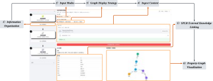

# E2K: An End-to-End Framework for Automatic Knowledge-Base Construction from Imperial Examination Texts


---
## Project Overview
**Background & Rationale.** Imperial-examination (*keju*) materials are rich but heterogeneous. Traditional close reading scales poorly and obscures weak cross-dimensional signals. **E2K** operationalizes a Digital Humanities workflow by turning unstructured classical Chinese into computable knowledge with provenance.

**What E2K Does.**
- **Ontology-grounded modeling** (RDF + CIDOC-CRM) for computable semantics
- **Bidirectional interoperability** between **Property Graph (PG)** and **RDF** via M0/M1 mappings
- **SPLR / OSPLR** for robust nested NER and PG auto-construction with external, ontology-typed knowledge
- **Auditable normalization** using rules, composite keys, and graph-consistency checks
- **Knowledge services**: fine-grained retrieval, descriptive stats, spatio-temporal trends, network exploration, GIS visualization

---


## Functional Modules
### 1) Information Organization
Automatically converts classical texts into a **Property Graph** guided by the domain ontology and extraction results (SPLR/OSPLR). Web UI supports batch upload and interactive editing; provenance is preserved end-to-end.



Key points:
- Batch ingestion of DOCX/JSON; interactive review/edit
- SPLR preview, candidate entity/attribute editing
- Export PG-JSON and ontology-aligned RDF

---

### 2) Information Disambiguation
An end-to-end scheduler executes a unified **PG → RDF** pipeline (20+ scripts), streaming logs and intermediate artifacts for auditability. Outputs `.nt` files editable in Protégé.


Highlights:
- Layout-guided provenance alignment (substring-first, fuzzy-fallback)
- Entity alignment & de-duplication with rules + composite keys
- Graph-consistency validation; OWL-ready RDF export

---

### 3) Knowledge Discovery
Integrated dashboards for **group-structure induction**, **spatio-temporal metrics**, **network exploration**, and **GIS** views. Coordinated multiple views link distributions, spatial patterns, relations, and temporal dynamics.


Includes:
- Cohort-indexed bar/line charts with opportunity-year normalization
- GIS maps with historical/modern toponym reconciliation
- Relation graphs (NetworkX → PyVis) with hover tooltips & filters

---

## Database Validation (Jinshi Kinship Network)

To validate empirical utility, E2K reproduces literature-confirmed **kinship pairs** among Ming-period Guizhou *jinshi* and discovers them **automatically** via the social-relations module:


- Identified **8/9** literature-confirmed pairs, **no false positives**, **1 miss** due to systematic textual gaps  
- **Precision (P)=100%**, **Recall (R)=88.89%**, **F1=94.12%**

---

---
## Data Description
- Format: JSONL knowledge graph data
- Scope: Examination candidates from Guizhou, Ming Dynasty, Zhengtong to Chongzhen reigns (1436–1644)
- Coverage: 95 individuals, with data on biography, family, examinations, official positions, and geography

## Directory Structure
```text
MingKG/
│
├── apps/                     
│   ├── disambiguation.py             
│   ├── info_organization.py          
│   └── knowledge_discovery.py       
├── configs/
│   └── config.yaml
├── data/                     
│   ├── input_text            
│   ├── KD        
│   └── Ming_PG_data
├── modules/      
│   ├── __init__.py/  
│   ├── dianshi_timeline.py/    
│   ├── ming_yearly_trend.py/    
│   ├── official_positions.py/    
│   ├── official_positions_metrics.py/   
│   ├── people_facets_ranks.py/  
│   ├── person_place_events.py/  
│   ├── person_profile_attrs.py/
│   ├── place_level_stats.py/    
│   └── social_relations.py/   
│
├── Pipeline
│
├── png
│
├── SPLR/                     
│   ├── __init__.py/           
│   ├── ds.py/
    ├── inference.py/
    ├── model.py/
    ├── osplr_prompt.py/         
│   └── utils.py
├── app.py           # Main entry point for launching the application/platform         
├── README.md                 
└── LICENSE

```
## Citation
``` markdown
https://github.com/hangqinlu/MingKG.
```
---
## License

``` markdown
MIT License, see LICENSE for details.

Copyright (c) 2025 Hangqin Lu

Permission is hereby granted, free of charge, to any person obtaining a copy
of this software and associated documentation files (the "Software"), to deal
in the Software without restriction, including without limitation the rights
to use, copy, modify, merge, publish, distribute, sublicense, and/or sell
copies of the Software, and to permit persons to whom the Software is
furnished to do so, subject to the following conditions:

The above copyright notice and this permission notice shall be included in all
copies or substantial portions of the Software.

THE SOFTWARE IS PROVIDED "AS IS", WITHOUT WARRANTY OF ANY KIND, EXPRESS OR
IMPLIED, INCLUDING BUT NOT LIMITED TO THE WARRANTIES OF MERCHANTABILITY,
FITNESS FOR A PARTICULAR PURPOSE AND NONINFRINGEMENT. IN NO EVENT SHALL THE
AUTHORS OR COPYRIGHT HOLDERS BE LIABLE FOR ANY CLAIM, DAMAGES OR OTHER
LIABILITY, WHETHER IN AN ACTION OF CONTRACT, TORT OR OTHERWISE, ARISING FROM,
OUT OF OR IN CONNECTION WITH THE SOFTWARE OR THE USE OR OTHER DEALINGS IN THE
SOFTWARE.
```

---