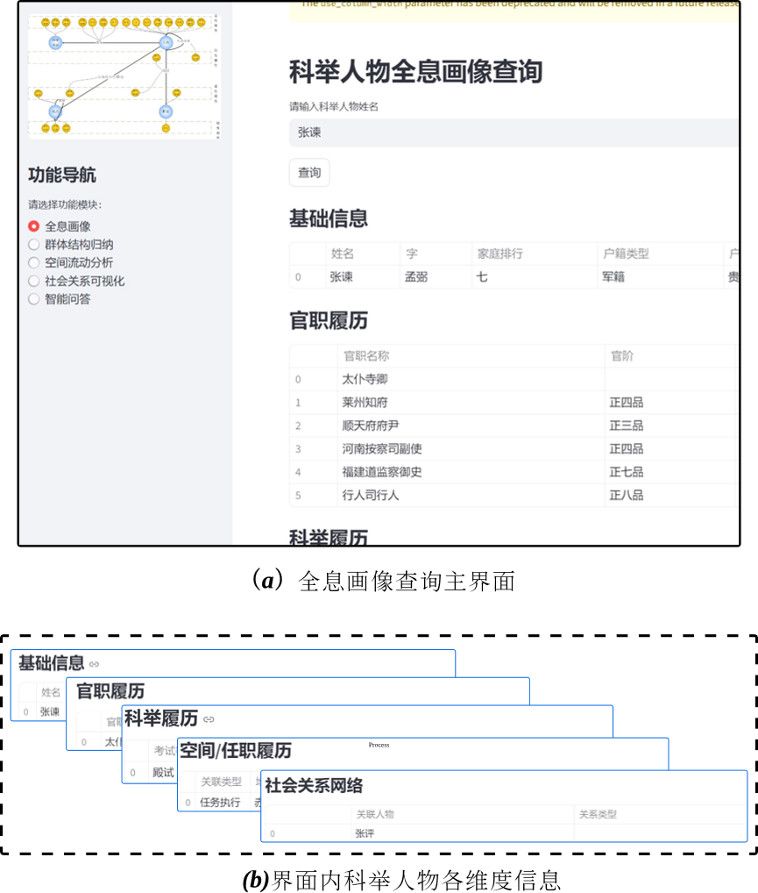
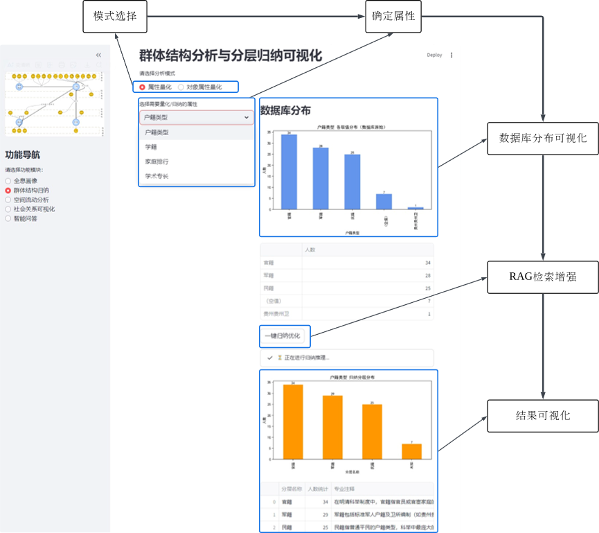
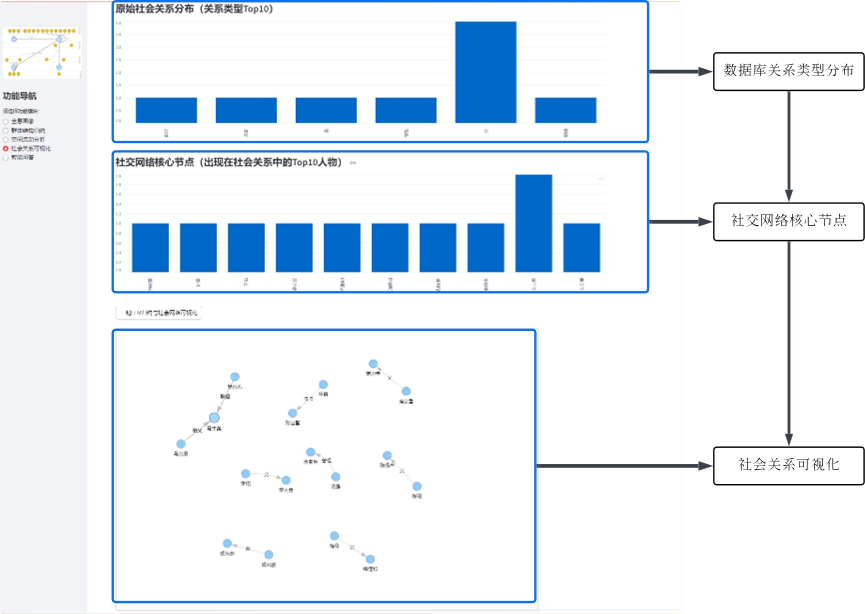
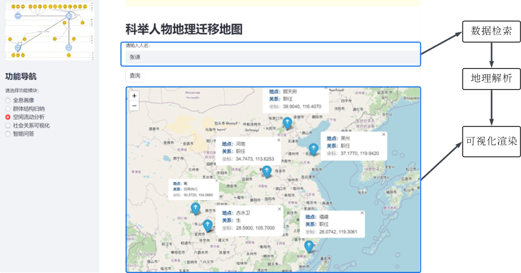
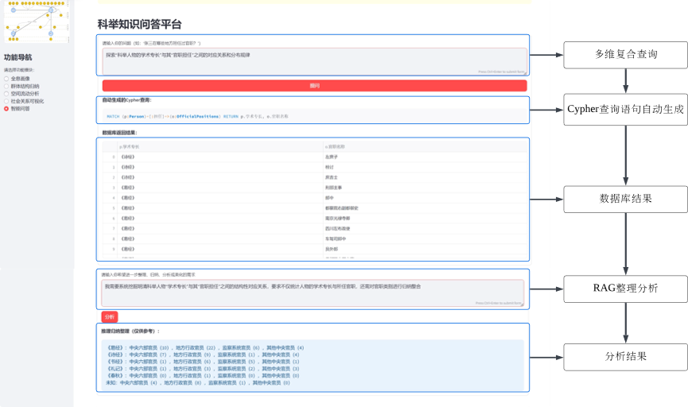

# Knowledge Graph of Ming Dynasty Guizhou Examination Candidates

This project aims to advance the structured management and multidimensional analysis of historical knowledge. The academic value of a knowledge graph lies not only in enhancing the structural representation of historical data, but also in supporting complex downstream applications such as intelligent Q&A and group structure analysis. To demonstrate the applicability and potential of knowledge graphs in quantitative historical research, this database focuses on the Guizhou region of the Ming Dynasty, spanning from the Zhengtong to the Chongzhen reigns. Automatically generated JSONL-format graph data cover 95 examination candidates.
---

## Functional Modules
 The database currently integrates and exposes five core functional modules:
- Comprehensive Biographical Profiling
Fuses multi-source historical information to enable accurate reconstruction of individual lives and family genealogies.
 
</p>
- Group Structure Induction
 
</p>
Supports high-dimensional, quantitative analysis of social stratification and the distribution of educational resources within the candidate group.
- Spatial Mobility Analysis
 
</p>
Focuses on the migration patterns and regional flows of examination candidates, providing spatiotemporal insights into historical geographic dynamics.
- Social Relationship Visualization
 
</p>
Reveals the internal structure and power diffusion pathways of elite examination families, enabling visual exploration of complex social networks.
- Intelligent Examination Q&A Platform
 
</p>
Powered by Retrieval-Augmented Generation (RAG), the platform enables natural language queries and automatic summarization, enhancing accessibility and analytical depth for historical knowledge services.

---
## Data Description
- Format: JSONL knowledge graph data
- Scope: Examination candidates from Guizhou, Ming Dynasty, Zhengtong to Chongzhen reigns (1436–1644)
- Coverage: 95 individuals, with data on biography, family, examinations, official positions, and geography

## Directory Structure
```text
MingKG/
│
├── data/                     # Datasets and database backups
│   ├── export.csv             # Knowledge graph exported in CSV format 
│   ├── export.json            # Knowledge graph exported in JSON format
│   └──neo4j.dump          # Full Neo4j database dump for restoration
│
├── modules/      # Core functional modules of the application
│   ├── __init__.py/  # Module initialization file
│   ├── module_group_obj.py/     # Module for group structure analysis
│   ├── module_profile.py/    # Module for comprehensive biographical profiling
│   ├── module_qa.py/    # Module for intelligent Q&A (retrieval and reasoning)
│   ├── module_space.py/    # Module for spatial mobility analysis
│   └── module_socila.py/   # Module for social relationship visualization
│
├── app.py           # Main entry point for launching the application/platform         
├── README.md                 
└── LICENSE

```
## Citation
``` markdown
https://github.com/hangqinlu/MingKG.
```
---
## License

``` markdown
MIT License, see LICENSE for details.

Copyright (c) 2025 Hangqin Lu

Permission is hereby granted, free of charge, to any person obtaining a copy
of this software and associated documentation files (the "Software"), to deal
in the Software without restriction, including without limitation the rights
to use, copy, modify, merge, publish, distribute, sublicense, and/or sell
copies of the Software, and to permit persons to whom the Software is
furnished to do so, subject to the following conditions:

The above copyright notice and this permission notice shall be included in all
copies or substantial portions of the Software.

THE SOFTWARE IS PROVIDED "AS IS", WITHOUT WARRANTY OF ANY KIND, EXPRESS OR
IMPLIED, INCLUDING BUT NOT LIMITED TO THE WARRANTIES OF MERCHANTABILITY,
FITNESS FOR A PARTICULAR PURPOSE AND NONINFRINGEMENT. IN NO EVENT SHALL THE
AUTHORS OR COPYRIGHT HOLDERS BE LIABLE FOR ANY CLAIM, DAMAGES OR OTHER
LIABILITY, WHETHER IN AN ACTION OF CONTRACT, TORT OR OTHERWISE, ARISING FROM,
OUT OF OR IN CONNECTION WITH THE SOFTWARE OR THE USE OR OTHER DEALINGS IN THE
SOFTWARE.
```

---
